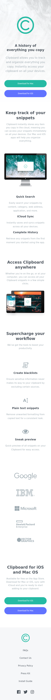
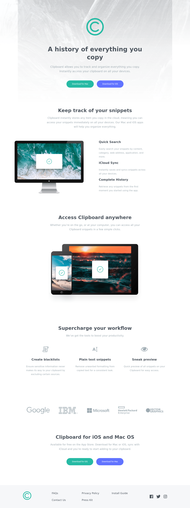

# Frontend Mentor - Clipboard landing page solution

This is a solution to the [Clipboard landing page challenge on Frontend Mentor](https://www.frontendmentor.io/challenges/clipboard-landing-page-5cc9bccd6c4c91111378ecb9). Frontend Mentor challenges help you improve your coding skills by building realistic projects. 

## Table of contents

- [Overview](#overview)
  - [The challenge](#the-challenge)
  - [Screenshot](#screenshot)
  - [Links](#links)
- [My process](#my-process)
  - [Built with](#built-with)
  - [What I learned](#what-i-learned)
  - [Continued development](#continued-development)
  - [Useful resources](#useful-resources)
- [Author](#author)
- [Acknowledgments](#acknowledgments)

## Overview

Put your layout skills to the test with this HTML & CSS landing page challenge. This challenge includes a design for hover states.

### The challenge

Users should be able to:

- View the optimal layout for the site depending on their device's screen size
- See hover states for all interactive elements on the page

### Screenshot

### Links

- Solution URL: [https://github.com/troy03/clipboard-landing-page)
- Live Site URL: [Add live site URL here](https://troy03.github.io/clipboard-landing-page/)

## My process

 I research a tutorial about SCSS in Youtube by finishing this tutorial I use SASS Documentation. I google more like mixin for breakpoints media queries.

### Built with

- Semantic HTML5 markup
- CSS custom properties
- Flexbox
- CSS Grid
- Mobile-first workflow

### What I learned

I learn more about SCSS including the mixin, nesting, partials and variables I use media queries by mixin but to be honest I prefer media queries in pure css

### Continued development

I will add an animation if I have time  to study.

### Useful resources

- [SASS Documentation](https://sass-lang.com/documentation/) - This helped me to grasp the syntax of SCSS.
- [Coder Coder](https://www.youtube.com/watch?v=jfMHA8SqUL4&t=1291s) - This a youtube channel it helps me about SCSS and bonus she teach BEM and Responsive for this course.

## Author

- Website - [troy03](https://github.com/troy03)
- Frontend Mentor - [troy03](https://www.frontendmentor.io/home)

## Acknowledgments

Thankful for frontend mentor community they the reason of my progress especially in HTML and CSS hope I advance to Intermediate Level.
